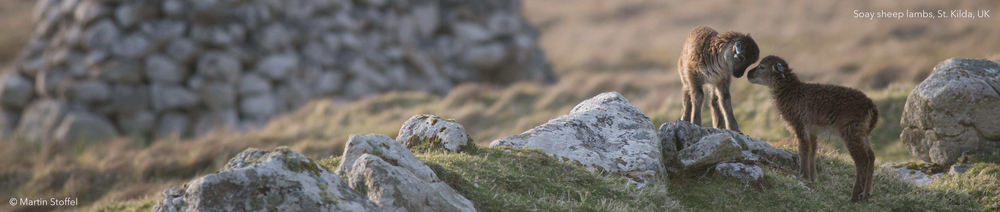
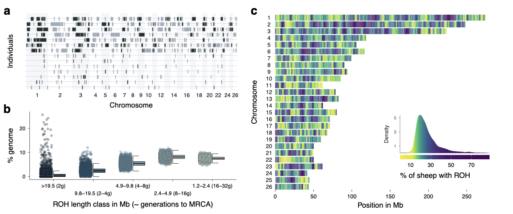

## Code and example data for:
  
Stoffel, MA, Johnston, SE, Pilkington, JG, Pemberton, JM: **Genetic architecture and lifetime dynamics of inbreeding depression in a wild mammal.**  *Nature Communications* **12**, 2972 (2021). https://doi.org/10.1038/s41467-021-23222-9.  

</br>

</br>

### Project
Across the animal and plant kingdoms, matings between relatives often result in reduced fitness of their offspring, a phenomenon termed inbreeding depression. This project aimed at gaining a better understanding of the genetic basis of inbreeding depression by analysing genomic and survival data from a long-term study of wild Soay sheep on the remote Scottish St. Kilda archipelago. At the heart of the analyses are runs of homozygosity, a signature feature of inbred genomes, which we used to pinpoint genetic regions containing deleterious mutations.

<p align="center">
  
</p>
<p align="center" > <i>Runs of homozygosity among individuals, length classes and across the genome .</i></p>


### Code structure
This repository contains the analysis code for our paper, in order 1-7.  

*Script 1-3 process data, specifically:*  
**1_preprocessing_and_ROH_calling:** Preprocesses genotype data and calls ROH  
**2_calculate_fitness_parameters_v2:** Transform tables from the Soay sheep database into a table with annual fitness measures  
**3_combine_ROH_and_fitness_data:** Calculates FROH and combines fitness and FROH data

*Scripts 4-7b contain the main analyses in the paper:*  
**4_ROH_patterns:** First part of the paper, including Figure 1  
**4b_ROH_recombination** Running window analyses / plots for ROH density and recombination
**5a_survival_models:** INLA animal models to quantify inbreeding depression in survival  
**5b_survival_models_figure:** Creates Figure 3 based on INLA output  
**6_alt_gwas_annual_survival_bothA_sep:** ROH GWAS, needs to run on a cluster  
**7a_gwas_postprocessing_bothA_sep:** Takes GWAS results, checks for errors and makes a Manhattan plot    
**7b_gwas_top_snps_sep:** Visualises genetic diversity and GWAS estimates in the genomic vicinity of GWAS peaks  
**99_add_suppl_figures:** Creates some additional figures for Supplementary Material  
**99_make_pcs_for_gwas:** Get PCs in the right format for use in GWAS.  

### Data and reproducibility
All analysis scripts (4-7b) can be run with data provided in the folders `example_data` and `example_output`. For a smooth experience with running these scripts, download the complete repository and change the names of `example_data` and `example_output` to `data` and `output`, respectively. Examples are based on a random subset of 100 individuals, so results will be different from those reported in the paper.

The full data can be downloaded from Zenodo: [](https://doi.org/10.5281/zenodo.4609701)

### Versions and dependencies
Running the code depends on a series of R packages, which mostly come from CRAN, but some are development versions on GitHub or stored on private websites. The versions of all dependencies are stored alongside the code in the `renv.lock` file. You can either install these packages yourself while running the code, or you can use the `renv` package to setup everything for you. To do so, download or clone this repository somewhere onto your computer. Then install `renv` with:

```r
if (!requireNamespace("remotes"))
  install.packages("remotes")

remotes::install_github("rstudio/renv")
```

You can then simply run `renv::init()` from the directory. This will find the `renv.lock` file and create an renv folder. The folder will contain a private R library with all the packages used in these scripts. This might take a while as there are a lot of packages to download and install. More info here: [https://rstudio.github.io/renv/](https://rstudio.github.io/renv/). Two packages have to be downloaded from private websites (INLA and AnimalINLA); the websites links are given in the scripts where they are used. 


### SNP chip preprocessing and imputation.
The scripts for some of the data preprocessing and for the genotype imputation are stored in the following repositories:
1) [SNP chip merging and LD decay](https://github.com/mastoffel/sheep)
2) [Genotype imputation and cross-validation](https://github.com/mastoffel/imputation_eddie)
3) [Imputation output postprocessing](https://github.com/mastoffel/imputation_mac)

